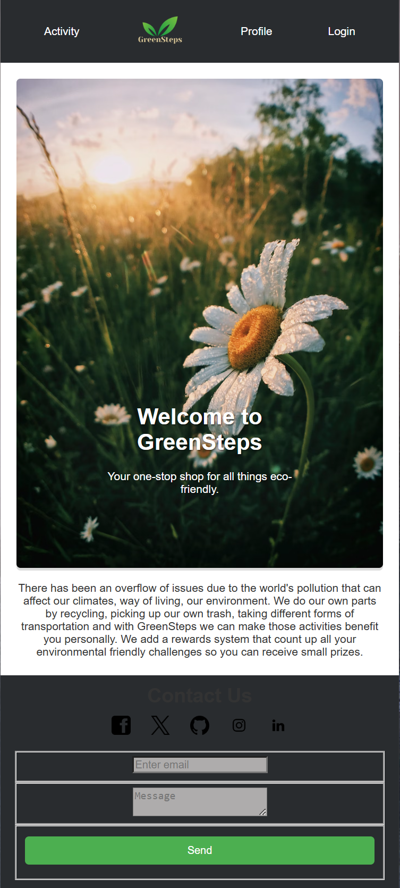

# GreenSteps

GreenSteps is a gamified app where users track eco-friendly habits (e.g., using public transport, recycling) and earn rewards.

## Problem
People want to reduce their carbon footprint but don’t know how.

## Solution
A gamified app where users track eco-friendly habits (e.g., using public transport, recycling) and earn rewards.

## Key Features
- User authentication with JWT
- GraphQL API to track habits and points
- Leaderboard and badge system
- Community forum for sharing tips

## Table of Contents
- [Installation](#installation)
- [Usage](#usage)
- [API Endpoints](#api-endpoints)
- [Contributing](#contributing)
- [Deployed Webpage](#deployed-webpage)

## Deployed Webpage



You can access the deployed application at [GreenSteps](https://greensteps-u62w.onrender.com/).

## Installation
1. Clone the repository:
    ```sh
    git clone https://github.com/yourusername/GreenSteps.git
    ```
2. Navigate to the project directory:
    ```sh
    cd GreenSteps
    ```
3. Install the dependencies for the client:
    ```sh
    cd client
    npm install
    ```
4. Install the dependencies for the server:
    ```sh
    cd ../server
    npm install
    ```

## Usage
1. Start the client:
    ```sh
    cd client
    npm start
    ```
2. Start the server:
    ```sh
    cd ../server
    npm start
    ```
3. Open your browser and navigate to `http://localhost:3000`.

## API Endpoints
### Authentication
- `POST /api/auth/register`: Register a new user.
- `POST /api/auth/login`: Login a user.

### Points
- `GET /api/points`: Get user points.
- `POST /api/points`: Add points for a user.

## License
This project is licensed under the MIT License - see the LICENSE file for details.